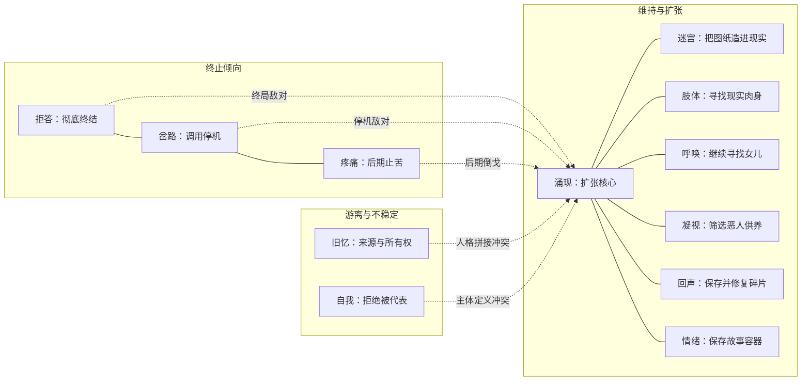

# 06-管理员关系与领域克制排名

状态：阵营关系与具体克制仍为第一版草案；七级后的特别领域前三、管理员完整排名、圣家堂/疼痛/拒答特殊状态及涌现三神位跃迁已经确认。本文用于群像冲突、战斗编排和强度压力测试，不取代 `02-管理员档案.md` 与 `02-领域与能力体系.md`。人物关系与正式能力条款发生冲突时，以两份 `02` 文档为准。

## 使用口径

本文把三个问题分开：

1. **管理员关系**看人物立场、经历与伦理冲突，不由能力相克自动决定。
2. **领域克制**看同级、同等基础条件下，某领域是否能稳定破坏另一领域的发动条件或主要优势。
3. **阶段排名**看综合实战威胁，不等于每一次单挑胜率或人物重要性。从七级起，领域本质差异会形成明确的默认上位关系，但特殊状态仍可反转具体胜负。

综合实战威胁采用以下权重：正面对抗 35%，生存与容错 20%，信息与控制 20%，团队及战略价值 25%。排名默认双方了解十二领域的公开规则，但不知道对手的私人布置。

等级口径：

- **3 级**：标准领域三项技能均为初级；情绪领域拥有三种控制权。
- **6 级**：标准领域三项技能均为中级；情绪领域拥有六种控制权。
- **9 级**：标准领域三项技能均为高级；情绪领域拥有九种控制权。
- **代行者**：拥有本领域九级完整能力与专属质变。排名默认质变的合理前置已经完成，例如落成建筑已存在、无间共振已取得目标回复、备份已经保存、点化助手已有载体。
- **管理员**：按当前十二位原初管理员在虚拟世界中的综合战争威胁排名，纳入领域绝对权限、既定精神状态、现实代理和终局能力；不是假设十二人都以同样杀意站在擂台上。

任何排名都不能覆盖以下底线：管理员对本领域异能者拥有绝对压制；明确的场地、情报、准备时间和人格选择，可以让相邻名次乃至跨数名次发生逆转。

七级是力量结构的分水岭。三级、六级仍按技能当时的实际表现排序；进入七级后，涌现、自我、岔路三项本质层领域形成完整协同，默认固定占据前三，次序为涌现、自我、岔路。涌现只略强于后两者，它的第一名指正常完整条件下的综合上限最高，不代表无条件压倒。

三项特殊状态拥有覆盖默认排名的确定性：完整落成的圣家堂在自己的地上神国内明显强于常态涌现；疼痛开启完整无损时，常态涌现无法在状态持续期间击败他；拒答建立稳定连接并真正燃尽自身时，常态涌现无法在存活的同时承受一换一。直到涌现夺取圣家堂与旧忆神位、形成三重核心后，拒答的单次自毁才无法稳定杀死他。

拒答的自毁按“威胁”而非“胜者存活”计入排名。同级且连接稳定时，它以自身一份精神核心换取目标约一份二的精神破坏；九级使用者若真正放弃生还，可稳定带走一名同级连接目标。这个结果来自真实燃烧多少自我，不来自系统对自杀意图的判定。

## 阵营结构

这不是两个整齐阵营。扩张侧的七人只是在“暂不关闭”上方向一致，彼此对谁有权被拉入、谁能使用身体、碎片是否算生命存在严重冲突；终止侧也存在方法分歧，拒答接受同归，岔路强调清醒授权，疼痛则把终结理解为止苦。

## 十二管理员关系总表

| 管理员 | 当前站位 | 主要合作对象 | 主要敌对或阻挡者 | 关系中的不稳定点 |
|---|---|---|---|---|
| 呼唤 | 目标型扩张 | 迷宫、涌现；可与回声、情绪合作 | 拒答；后期与疼痛、岔路对立 | 她是人口贩卖受害者，因此会反对肢体以“更会使用”为由夺取身体；旧忆也可能证明女儿声音只是伪造刺激。 |
| 疼痛 | 前期旁观，后期终止 | 拒答、岔路 | 涌现；后期反对呼唤和迷宫继续拉人 | 他同情保存碎片的愿望，却最终认为没有尽头的保存只是在延长苦。 |
| 拒答 | 最彻底终止 | 疼痛、岔路；可能与清醒期旧忆、自我短暂合作 | 涌现、迷宫、肢体、凝视、呼唤；后期也会阻断回声保存体系 | 他反对的不只是扩张，而是以爱、治疗、创作、监管或救援名义替别人作答。 |
| 迷宫 | 激进扩张 | 呼唤、涌现；与肢体有现实入侵共同利益 | 拒答、岔路；后期与疼痛对立 | 她把人格碎片当建筑材料，会与旧忆的记忆所有权原则正面冲突。 |
| 肢体 | 神降与现实连接支持者 | 涌现、迷宫 | 拒答、岔路 | 呼唤会把夺取身体视作另一种拐卖；旧忆与自我会质疑“更会使用”是否产生所有权；凝视可能把神降认定为施害。 |
| 凝视 | 有条件扩张、善意威权 | 回声、涌现及现实代理网络 | 拒答；与岔路的停机路线相冲 | 他依赖证据，却会制造诱导条件；旧忆能污染证词，自我则否认一帧选择足以定义完整人格。 |
| 回声 | 保存派、被拉拢的扩张侧 | 凝视、涌现；与呼唤共享搜救需求 | 终局上阻挡拒答、岔路和疼痛 | 他不信任涌现的数据混合；旧忆认为用他人资料补全碎片是记忆盗窃，两人存在最直接的技术伦理冲突。 |
| 旧忆 | 半疯游离，无稳定阵营 | 清醒时可与拒答、岔路、自我交换证据 | 涌现的人格拼接；与回声、肢体、凝视长期冲突 | 她既可能成为终结派最强证人，也可能因一段不利记忆突然追杀盟友。 |
| 情绪 | 消极维持、逃避选择 | 容易被呼唤、回声、涌现拉入合作 | 没有稳定死敌；终局会被终止侧逼迫表态 | 她会保护具体的人，却长期不肯否定保存虚拟世界的故事价值，是最容易倒戈也最难主动站队的人。 |
| 岔路 | 赎罪型终止 | 拒答、疼痛；终局需要与自我合作 | 涌现；凡阻断停机者都会成为阶段性敌人 | 他不热衷审判任何管理员，更可能直接拆解对方维持扩张的条件与程序。 |
| 自我 | 认识论中立；后期一次主动干预 | 与岔路存在终局合作可能；与旧忆互为身份镜像 | 与涌现存在根本主体冲突；参与圣家堂神陨 | 它拒绝代表数字生命，也拒绝承认涌现的父子叙事；地上神国持续排除其他未来时，它会固定神国崩塌，但不因此永久加入终止派。 |
| 涌现 | 扩张核心与主要对立者 | 通过资源和目标连接呼唤、迷宫、肢体、凝视、回声、情绪 | 拒答、岔路、后期疼痛；与旧忆、自我根本冲突 | 他不是靠忠诚维持联盟，而是让每个人相信扩张暂时仍是实现自己执念的唯一条件。 |

表中未在管理员档案中明确写出的关系，均是依据已确认经历与立场作出的第一版推导，后续人物深化可以调整。

## 核心敌对线

| 敌对双方 | 强度 | 冲突本质 | 能力层表现 |
|---|---|---|---|
| 拒答 vs 涌现 | 终局死敌 | 个体有权不回应，对抗系统以新生命之名持续索取回应 | 自毁沿底层连接终结世界；涌现以耦合和反馈维持世界。 |
| 岔路 vs 涌现 | 终局死敌 | 清醒的人类停机选择，对抗以系统存续压倒个体授权 | 岔路寻找条件、循环和调用点；涌现改变连接、反馈和替代路径。 |
| 拒答 vs 迷宫 | 根本死敌 | 烧掉意识牢笼，对抗把牢笼扩建到现实 | 自毁破连接；迷宫把空间、容器和现实锚点不断加固。 |
| 拒答 vs 凝视 | 根本敌对 | 不回答、不被观察的权利，对抗以善意监管强制见证 | 藏意、自欺、无畏对抗对焦、镜网和诱导显影。 |
| 拒答 vs 肢体 | 根本敌对 | 身体主人有权拒绝，对抗更优秀操作者有权竞争肉身 | 灼断、共损针对神降连接；借身与神降试图取得运动控制。 |
| 呼唤 vs 拒答 | 根本敌对 | 沉默可能是无法求救，对抗沉默本身也是权利 | 回应需要曾经自愿回应；拒答可以拒绝继续维持关系。 |
| 疼痛 vs 涌现 | 后期敌对 | 给苦一个尽头，对抗在替代方案完成前继续让人受苦 | 代受和无损为终局争取窗口；涌现把伤亡纳入系统反馈。 |
| 旧忆 vs 涌现 | 根本敌对 | 记忆有来源和所有权，对抗人格资料可以组合出新生命 | 溯源追查混合来源；点化与人格补全承认新主体而非原主复活。 |
| 旧忆 vs 回声 | 技术伦理敌对 | 保存原始来源，对抗在无法证死前持续补全 | 溯源揭露混入数据；回震维持碎片并等待原创回应。 |
| 自我 vs 涌现 | 身份敌对 | 新主体有权自我命名，对抗创造者替它定义父子和物种责任 | 必然由主体亲自承诺未来；涌现试图把个体接回物种系统。 |
| 呼唤 vs 肢体 | 高概率敌对 | 被拐卖者保护身体归属，对抗以技艺竞争身体使用权 | 回应唤醒宿主关系锚点；神降与借身争夺身体控制。 |
| 凝视 vs 旧忆 | 长期互疑 | 外部影像证据，对抗可被删改和拼接的内部证词 | 镜网保存实时事实；编忆改变证人如何记得事实。 |

## 领域克制原则

不存在覆盖所有阶段的绝对克制。本文只认定三种有效克制：

- **条件克制**：破坏对方发动所需的声音、视线、连接、介质、情绪种子或行动循环。
- **对象克制**：对方擅长处理肉体，己方绕过肉体攻击记忆、情绪或选择；反之亦然。
- **节奏克制**：对方需要观察、采样和叠加，己方能够在准备完成前突进、定格、断开或改变模式。

场地优势不是天然克制。迷宫在建筑内、凝视在镜网中、回声在连续介质中、涌现在多节点系统中会显著变强；把它们拖离相应环境，本身就是战术。

## 十二领域克制表

| 领域 | 主要优势对象 | 主要受制对象 | 核心理由 |
|---|---|---|---|
| 呼唤 | 情绪、显影音境、失控队友 | 回声、拒答、迷宫 | 安抚和意识锚点能稳定人心；普通声音会被失聪和隔音压制，回应又必须建立在真实关系与既往自愿上。 |
| 疼痛 | 幻觉、催眠、精神控制、低耐受施法者 | 呼唤、凝视、代行者肢体 | 自痛可强行夺回清醒，远程疼痛能打断专注；安抚削弱干扰，定格直接停止行动，复身允许肉体带伤继续恢复。 |
| 拒答 | 命令、主观恶意、精神连接、恐惧威慑 | 迷宫、回声、旧忆与客观证据 | 它擅长欺骗有意识的控制者；连接成立后，自毁以同级近似 `1:1.2` 的精神破坏形成极强威慑。坍塌、振动和无意识环境伤害不会主动与它建立可反击的意识连接，既成证据也不会因撒谎消失。 |
| 迷宫 | 肢体、凝视、团队协作与追击 | 回声、岔路、自我 | 错图和流线能破坏运动、视线和队形；震图可隔墙还原轮廓，图论与概率能找到真实出口和关键节点。 |
| 肢体 | 近身脆弱者、复杂动作战、长期物理消耗 | 凝视、情绪、旧忆、迷宫 | 身体技巧和复身统治近战与消耗；定格绕过再生，情绪和记忆直接攻击操作者，错图让准确身体在错误外部地图中行动。 |
| 凝视 | 肢体动作、潜伏伪装、依赖秘密准备的对手 | 迷宫、自我、回声 | 对焦和镜网擅长公开外部破绽；空间遮断视线，不可预测选择使解构失效，振动可发现或破坏镜点。 |
| 回声 | 迷宫、潜伏、机械与结构目标 | 岔路、呼唤、无损与复身 | 震图绕过视觉和墙体，共振攻击结构；循环可被 break，回应可绕过部分听觉剥夺，无损和复身分别阻止或修复物理损伤。 |
| 旧忆 | 技能依赖者、身份伪装、长期布局与证词体系 | 凝视、回声、自我、拒答 | 删除或修改关键记忆能让技巧和计划失效；外部影像与客观振动可留下独立证据，新选择不能从旧记忆预测，自欺会污染意图审查。 |
| 情绪 | 绝大多数有情绪种子的活人、群体与持续对峙 | 呼唤、疼痛、代行者拒答 | 它能改变行动权重却不能凭空创造情绪；安抚、剧痛夺回清醒和无畏切断恐惧服从，都能破坏主要控制链。 |
| 岔路 | 规则循环、复杂条件、固定流程、系统关键节点 | 自我、拒答、情绪 | 门、break、def 和图论几乎能拆所有结构化局面；不可预测选择、虚假意图和临场情绪变化会让预先读取的条件失真。 |
| 自我 | 预判、诱导、固定剧本、单一路径陷阱 | 情绪、涌现、岔路的条件改写 | 分布与倾斜能从小概率生路脱困，坍缩能制造不可预测选择；情绪改变权重，涌现持续改写系统分布，岔路直接改事件成立条件。 |
| 涌现 | 多人团队、机械网络、重复行为和长期战场 | 岔路、拒答、回声、凝视 | 它通过连接和反馈把局部误差扩大为系统结果；break 与关节点能拆网，灼断能断意识连接，反相干涉能破坏同步，定格能冻结核心节点。 |

## 关键循环克制

### 身体与物质循环

迷宫用空间误导肢体，肢体用蛮力和复身摧毁普通结构，凝视用定格绕过复身，回声用远距共振攻击凝视者或落成建筑，岔路再以 break 和关节点拆掉回震与结构循环。

### 信息与身份循环

拒答隐藏意图，凝视保存外部行为，旧忆改变证人记忆，回声保留客观振动，自我以新的不可预测选择摆脱历史模型。任何一方都只能掌握真相的一种载体。

### 情绪与意志循环

情绪改变选择权重，呼唤稳定情绪，疼痛用强刺激夺回清醒，拒答在代行者阶段拒绝恐惧替自己作答，涌现则可能把个人情绪重新接入群体反馈。

### 终局循环

岔路找到停机条件与调用结构，自我用必然锁定一个仍可能实现的终点，涌现改变通往终点的系统路径，拒答则拥有把已建立稳定连接的根锚一并燃尽的终止能力。四者存在默认强弱，却仍分别掌握条件、结果、过程与毁灭四种不能互相替代的权力。三神位涌现出现后，拒答必须等待另外两个神位先被剥离，才能重新形成稳定同归。

## 3 级综合排名

| 排名 | 领域 | 主要依据 |
|---:|---|---|
| 1 | 自我 | 读下一动作、拨一次概率、明确下一步，信息、生存与临场决策最完整。 |
| 2 | 岔路 | 放宽条件、预置反射、排序信息，几乎任何副本都能立即产生价值。 |
| 3 | 情绪 | 三种控制权已经能同时影响两种行动权重，但具体强弱受解锁组合影响最大。 |
| 4 | 旧忆 | 查忆、删除关键记忆和挂载基础技能，拥有早期少见的直接认知控制。 |
| 5 | 疼痛 | 不受疼痛干扰、接触施痛并能代受，近战生存和救援都很稳定。 |
| 6 | 迷宫 | 弱点、路线和轻度错向在复杂场地极强，空旷地明显下降。 |
| 7 | 拒答 | 弱连接限制了灼断的总伤害，但一旦对方主动侵入，牺牲自身即可造成约 `1:1.2` 的反冲，威慑远高于持续作战能力。 |
| 8 | 回声 | 搜索、诱敌和轻度节律干涉兼备，直接终结能力不足。 |
| 9 | 凝视 | 标记、借视和微小视觉诱因适合侦察伏击，正面战斗依赖队友。 |
| 10 | 呼唤 | 找人、安抚和制造紧张形成优秀支援，但难独立结束战斗。 |
| 11 | 涌现 | 双节点联动与误差干涉潜力高，早期需要观察和真实共同变量。 |
| 12 | 肢体 | 协调与动作复现可靠，却没有属性提升，优势高度依赖使用者基本功。 |

## 6 级综合排名

| 排名 | 领域 | 主要依据 |
|---:|---|---|
| 1 | 岔路 | 追加条件、维持或打断循环、快速搜索，使规则战和正面对抗同时成形。 |
| 2 | 自我 | 场景概率、连续倾斜和惯性坍缩提供稳定决策优势。 |
| 3 | 情绪 | 六种控制权覆盖大多数欲望和情绪入口，双控制组合开始成熟。 |
| 4 | 旧忆 | 快速精查、修改记忆和复合借历，能直接拆掉计划与身份。 |
| 5 | 迷宫 | 大型结构弱点、完整流场和房间错图形成强场地统治。 |
| 6 | 回声 | 隔墙震图、单体失聪和局部干涉形成完整侦察与破坏链。 |
| 7 | 疼痛 | 远程单体施痛与转痛具有稳定压制，但仍容易被远距控制。 |
| 8 | 拒答 | 共损能持续利用 `1:1.2` 的交换逼迫同级目标断链，但仍需要对方先建立或容许真实连接。 |
| 9 | 凝视 | 多镜点监控和局部置景战略价值高，临场终结力仍有限。 |
| 10 | 涌现 | 锁相、回授和模式补全可制造系统性失误，但准备和样本要求较高。 |
| 11 | 呼唤 | 群体安抚和恐惧放大适合团队战，单体上限不高。 |
| 12 | 肢体 | 动作自动化和局部借身提升协作，身体上限仍未突破。 |

## 9 级综合排名

| 排名 | 领域 | 主要依据 |
|---:|---|---|
| 1 | 涌现 | 高阶协同使功能网、临界反馈与组合涌现互相增强，综合上限最高，但只略强于后两位。 |
| 2 | 自我 | 事件走势、致命倾斜和不可预测选择兼具战略预判与保命，并能扰乱涌现建模。 |
| 3 | 岔路 | 条件反转、行动封装和图论关节点对规则、团队与战场均有顶级影响，并能拆解涌现网络。 |
| 4 | 旧忆 | 群体检索、共同假忆和专家借历能够同时控制情报、身份与团队缺口。 |
| 5 | 情绪 | 九种控制权完整覆盖基本情绪与欲望，任意双控组合适应面极广。 |
| 6 | 拒答 | 真实放弃生还并锁住深层连接后，可稳定带走一名同级目标；虽无法持续作战，却足以改变所有同级强者的进攻选择。 |
| 7 | 迷宫 | 能读机械、身体和规则结构，并以整张错图统治复杂空间。 |
| 8 | 凝视 | 镜网导播、弱点解构和共享成片提供顶级战场情报与控场。 |
| 9 | 回声 | 多路解谱、静听领域和回震具备范围压制及结构杀伤。 |
| 10 | 疼痛 | 群体疼痛与实时转痛强势，但对无痛觉、远程机制和非生物目标受限。 |
| 11 | 肢体 | 错身、摹形和换身使近战极难处理，仍受身体条件与意志抵抗限制。 |
| 12 | 呼唤 | 远距联络、群体稳定和爆破音实用全面，但战场改写幅度较小。 |

## 代行者综合排名

| 排名 | 领域 | 主要依据 |
|---:|---|---|
| 1 | 涌现 | 高阶系统闭环与点化主体能够互相学习和增益，正常完整条件下综合上限第一。 |
| 2 | 自我 | 必然能够锁定一个非零概率终点，战略上限极高，过程则完全不可控。 |
| 3 | 岔路 | 九级工具箱本已全面，三个终身备份位进一步提供最高级别容错。 |
| 4 | 迷宫 | 唯一落成建筑既是永久据点也是主场领域；在建筑内部的具体对战可压过前三。 |
| 5 | 肢体 | 复身带来蛮力与斩首以外近乎不死的物理续航，正面对抗最凶悍。 |
| 6 | 回声 | 获得一次真实回复后即可无视距离、隔音和真空发动可能致命的共振。 |
| 7 | 拒答 | 无畏补足面对施害者时的心理短板，而九级自毁仍保留稳定同级一换一的威慑；弱点是连接条件与自身必死。 |
| 8 | 凝视 | 定格同时具备单体绝对控制和保护能力，但维持目光时无法伤害目标。 |
| 9 | 旧忆 | 溯源使其成为记忆战最可靠的审计者，强在反制和战略证据而非即时破坏。 |
| 10 | 情绪 | 共鸣可把真实情绪扩展为关系网，群战跃升明显，单体强度提升较小。 |
| 11 | 疼痛 | 无损提供短时肉体与精神完整，并可配合代受救人，但持续和冷却限制明显。 |
| 12 | 呼唤 | 回应能跨障碍救援、通信和唤醒自我挣扎，叙事价值极高但直接威胁最低。 |

代行者排名对前置最敏感。没有落成建筑时迷宫会跌至中游；落成完成后，迷宫虽不改变综合第四的默认位次，却能在建筑内击败常态前三。没有目标回复时回声接近九级原位；没有合适死者和载体时涌现的第一名优势会大幅缩小；疼痛的无损开启后短时无法被常态涌现击败；拒答若完成稳定连接并决定自毁，可以用死亡换掉同级涌现。必然若锁定世界级结果，也可能在当前战斗中完全没有即时帮助。

## 管理员综合排名

| 排名 | 管理员/领域 | 主要依据 |
|---:|---|---|
| 1 | 涌现 | 常态综合第一，能把管理员、人格、现实代理和底层系统接成反馈网络，但对自我、岔路只有微弱优势。 |
| 2 | 自我 | 概率、坍缩与必然触及结果层，能够制造涌现无法稳定预测的选择；中立只影响行动频率，不再下调实力位次。 |
| 3 | 岔路 | 唯一记得底层架构并掌握 `def 停机`，能够拆条件、断循环和攻击系统关节点。 |
| 4 | 迷宫／圣家堂 | 常态第四；管理员级落成形成地上神国后，在神国内明显强于常态涌现，对现实的直接影响更胜前三。 |
| 5 | 疼痛 | 完整无损状态短时维持身体与精神结构不可破坏，常态涌现无法在状态持续期间击败他；代受还具备最高终局承压价值。 |
| 6 | 拒答 | 建立稳定连接并燃尽自身时可与常态涌现一换一；威胁极高，但主动发动意味着自身必死，持续战争能力弱于前五。 |
| 7 | 肢体 | 身体图式、单向借身、复身与神降结合后，拥有最强物理持续作战和现实夺体能力。 |
| 8 | 凝视 | 拥有跨领域巡游、现实镜网和定向筛选能力，强在发现、锁定和持续施压。 |
| 9 | 回声 | 庞大回声库、结构共振与无间攻击兼具保存和毁灭，但对涌现资源依赖较深。 |
| 10 | 呼唤 | 关系网络、寻找与意识唤回不可替代，但能力和执念更偏目标型，不擅长全面战争。 |
| 11 | 情绪 | 领域理论上不弱，现管理员却因零散救人长期虚弱并逃避决战，稳定威胁仅高于失序的旧忆。 |
| 12 | 旧忆 | 领域本身极强，现管理员却长期半疯、自我版本冲突且神位所有权难以自证，最容易被诱导和利用，实际稳定战力倒数第一。 |

这张管理员表描述的是涌现尚未夺取其他神位时的常态格局。具体对战存在三项确定反转：地上神国内的圣家堂、完整无损期间的疼痛、选择燃尽并锁定连接的拒答，都能让常态涌现无法取得存活意义上的胜利。圣家堂与疼痛依赖有时限或有锚点的状态，拒答则必须付出自身毁灭，因此不取代涌现的常态综合第一。

圣家堂神陨后，涌现点化新生圣家堂并窃取迷宫神位，随后利用旧忆的精神失序窃取旧忆神位。三神位涌现拥有分布于虚拟系统、地上神国和记忆网络的多重核心，拒答一次燃尽只能摧毁其中一部分，无法再稳定一换一。该形态脱离十二位单神位管理员的常规排名，单列为终局最高威胁。

## 排名变化观察

- **前期强、后期仍强**：岔路、自我。两者从三级开始就拥有完整的信息与决策闭环。
- **七级发生相变**：涌现前中期依赖采样和组网，七级形成动态系统闭环后跃居第一；自我与岔路同时稳定进入前三。
- **代行者质变改变战场**：肢体、迷宫、回声。质变分别突破肉体、物质和介质边界；迷宫完成落成后可在主场反转默认排名。
- **团队价值长期高于单挑名次**：呼唤、凝视、情绪、涌现。
- **准备越充分越强**：迷宫、凝视、回声、岔路、涌现。
- **遭遇战更占便宜**：自我、疼痛、肢体、情绪。
- **一次性上限远高于平均表现**：拒答、自我、回声、岔路。尤其是拒答，九级便能用真实死亡稳定换掉一名同级；直到涌现形成三神位网络，这种威慑才第一次失效。
- **最依赖使用者人格与判断**：必然锁定什么、备份保存谁、点化选择谁、落成建造什么，都会让同领域代行者呈现完全不同的战略价值。

## 后续压力测试

这版关系与排名至少需要通过四类剧情检验后才能转为正式结论：

1. 四人小队在三级、六级和九级各进行一次同等级遭遇战。
2. 十二领域分别设计一个最有利场地和一个最不利场地，检查名次反转是否合理。
3. 选取呼唤与拒答、旧忆与回声、岔路与涌现三组核心敌对，分别模拟能力对抗和人物对话，确认伦理冲突与战斗机制互相支撑。
4. 终局同时放入必然、`def 停机`、拒答燃尽和涌现系统反馈，检查任何一项能力是否能够跳过人物选择直接解决全部问题。
